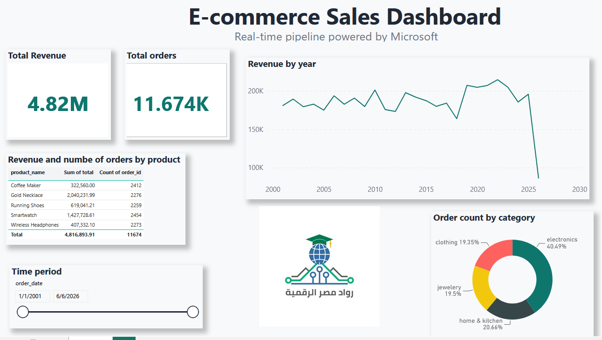

# Real-Time E-Commerce Data Pipeline

## Overview
A real-time data engineering project built on Microsoft Fabric 
that ingests, cleans, models and visualises e-commerce 
transactions as they arrive.

## Architecture
Python Script → Eventstream → Lakehouse → Power BI

### Medallion Architecture
- Bronze: raw_orders (raw data as received)
- Silver: clean_orders (cleaned via streaming SQL)
- Gold: gold_orders, dim_products, dim_users, dim_date (views)

## Tech Stack
- Microsoft Fabric (Eventstream, Lakehouse, SQL Analytics)
- Python (Faker, azure-eventhub)
- Power BI
- T-SQL

## Data Pipeline
1. Python script generates synthetic e-commerce orders
2. Azure Event Hubs / Eventstream receives events in real time
3. Streaming SQL cleans data on arrival
4. Gold layer views deduplicate and model data
5. Power BI dashboard visualises insights

## Data Quality Issues Handled
- Null user_id → replaced with 'unknown'
- Price as string → cast to float
- Inconsistent timestamp formats → handled with CONVERT/TRY_CAST
- Duplicate order_ids → deduplicated with ROW_NUMBER()
- Null payment_method → replaced with 'unknown'

## Dashboard

## How to Run
1. Install dependencies:
   pip install azure-eventhub faker

2. Update connection string in data_generator.py:
   CONNECTION_STRING = "your-eventstream-connection-string"
   EVENTHUB_NAME = "your-eventhub-name"

3. Run the generator:
   python data_generator.py

## Future Improvements
- Add Dataflow Gen2 for physical Gold tables
- Add ML fraud detection model
- Schedule pipeline for automated Gold layer refresh
- Add more product categories and realistic pricing